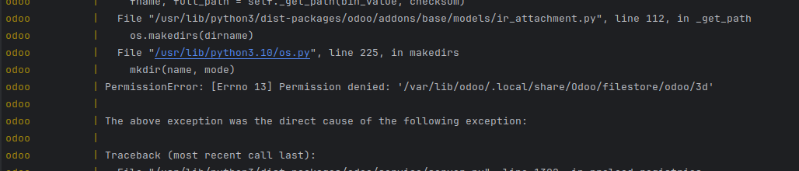
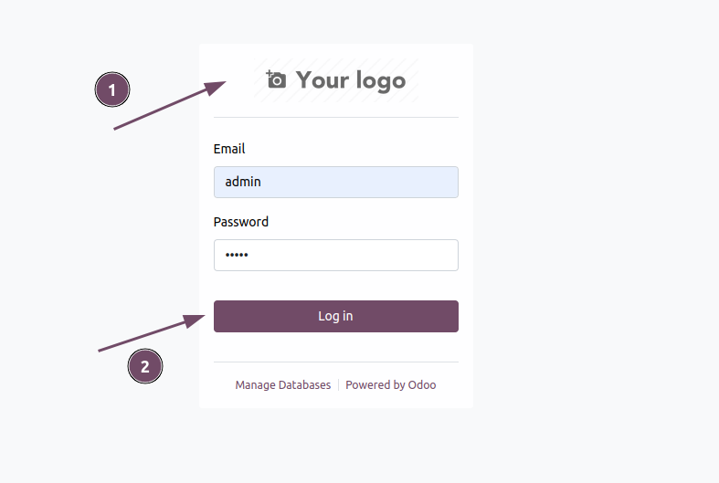
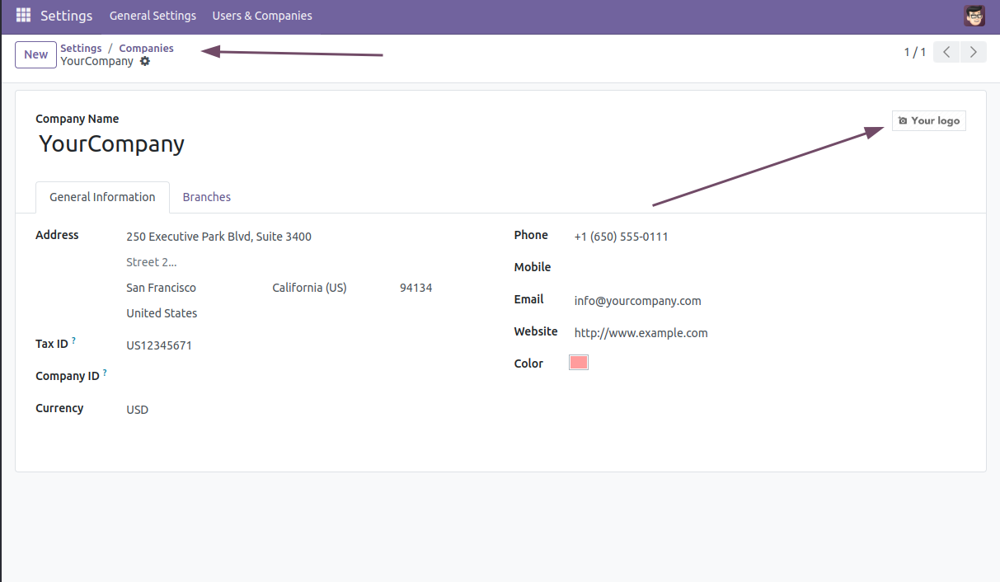
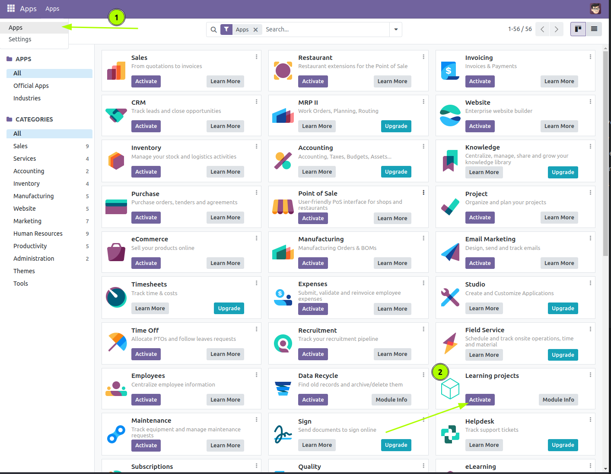
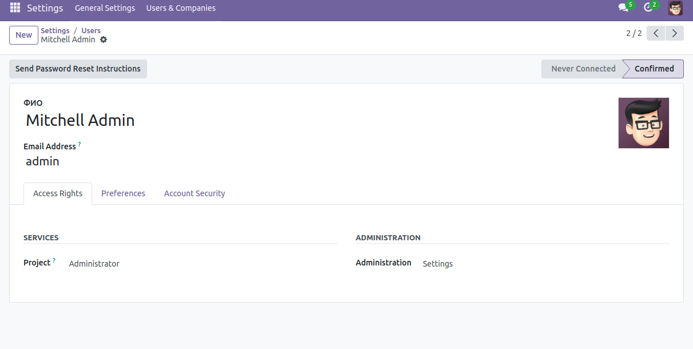
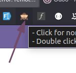
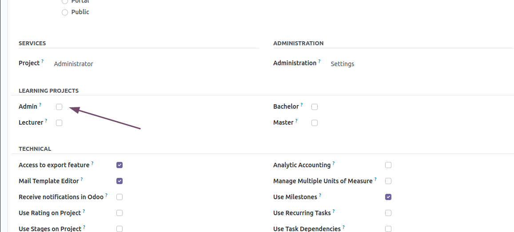
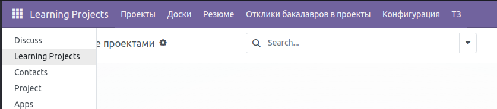
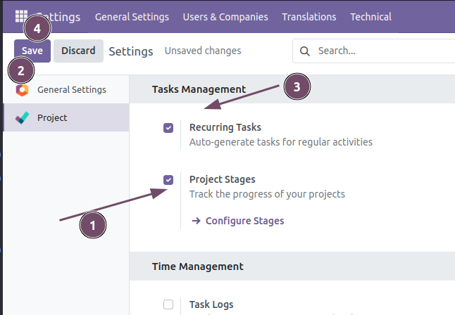
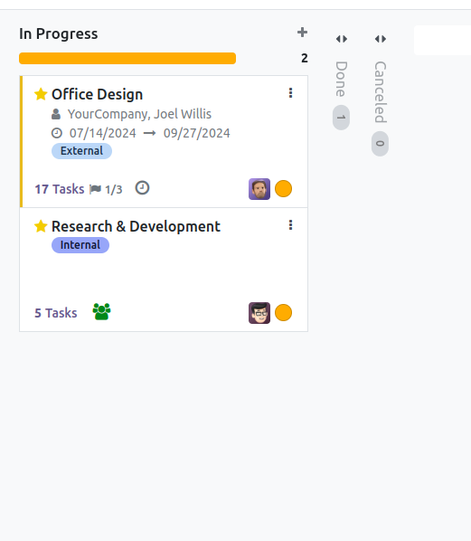

# Запуск Odoo 

1. `docker-compose up` Запускает odoo и её зависимости.
    
    ## Problems
    
    [Solved]  
    ```
     sudo chmod -R 777 data/*
    ```

2. `docker-compose restart odoo` переустанавливает модуль `learning_projects`

3. Успешная загрузка модуля
```
odoo          | 2024-09-15 12:03:02,001 1 INFO odoo odoo.modules.loading: loading web_unsplash/views/res_config_settings_view.xml 
odoo          | 2024-09-15 12:03:02,019 1 INFO odoo odoo.modules.loading: Module web_unsplash loaded in 0.06s, 93 queries (+93 other) 
odoo          | 2024-09-15 12:03:02,019 1 INFO odoo odoo.modules.loading: 11 modules loaded in 1.75s, 3464 queries (+3464 extra) 
odoo          | 2024-09-15 12:03:02,146 1 INFO odoo odoo.modules.loading: Modules loaded. 
odoo          | 2024-09-15 12:03:02,148 1 INFO odoo odoo.modules.registry: Registry loaded in 8.555s 
```

# Настройка Odoo 

Сайт будет доступен по http://localhost/



1. Логотип можно через Настройки -> Компания
Исправите данные подходящие для вас.
 
2. Стандартный логин и пароль admin.
Если у вас возникла ошибка установите плагин еще раз.



После установки у вас появятся новые плагины


Для того чтобы появился наш плагин. Необходимо дать права для нашего пользователя 
Настройки -> Manage Users -> Mitchell Admin (или другой пользователь) 
В данный момент отображены не все настройки.


[Плагин](https://chromewebstore.google.com/detail/odoo-debug/hmdmhilocobgohohpdpolmibjklfgkbi?pli=1) для браузера, который позволят перевести odoo в режим разработчика. 

Или делать это каждый раз в настройках odoo 

Настройки -> Developer Tools -> Activate the developer mode



Роли доступные в рамках системы


Активируем права админа.


Модуль доступен.

Финальные настройки удалить или архивировать всех лишних пользователей из модуля контакты
Также архивировать проекты, которые создаёт odoo по умолчанию.



Скрыть не использующиеся теги можно Configure Stages



# Приглашение пользователей в систему.
