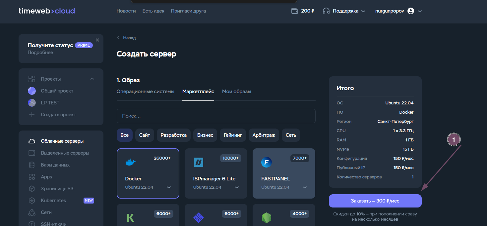
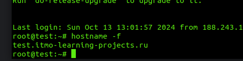
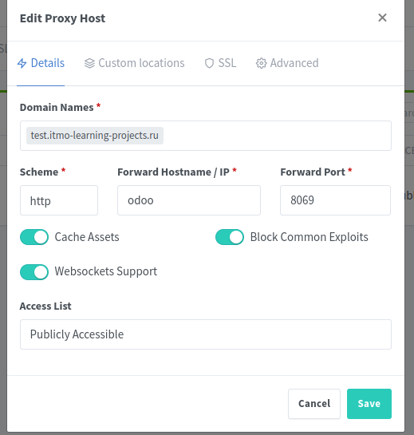
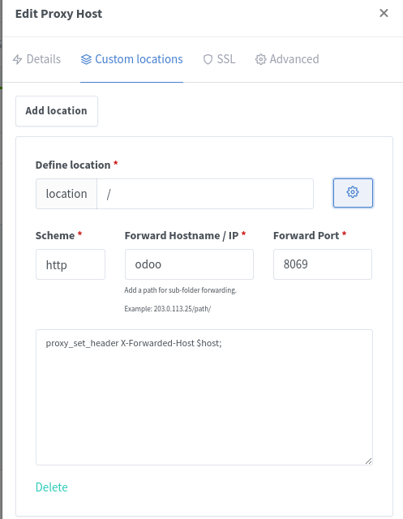
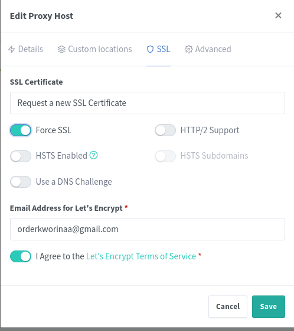

# Развертывание

# Покупаем

Покупаем сервер в докером




# Развертывание тест


```
ssh root@92.53.115.120
```

hostname -f

nano /etc/hostname
nano /etc/hosts

change domain -> test.itmo-learning-projects.ru

reboot



Change email

ssh-keygen -t ed25519 -C "anton0afanasiev0v@gmail.com"


cat /root/.ssh/id_ed25519.pub
add to github  in deploy-keys

[Источник deploy-keys](https://docs.github.com/ru/authentication/connecting-to-github-with-ssh/managing-deploy-keys#deploy-keys)


cd /home/
git clone git@github.com:learningprojectsitmo/platform.git

cd platform/
docker-compose -f docker-compose.test.yml up
sudo chmod -R 777 data/*

http://test.itmo-learning-projects.ru:81/nginx/proxy

Default Admin User:

    Email:    admin@example.com
    Password: changeme

change Default








